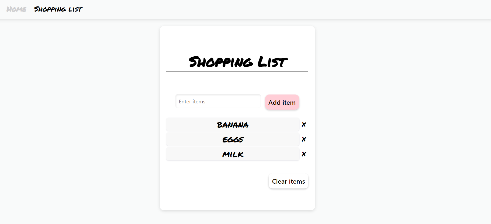

# shoppingList

My version of the classic *Shopping List* app.

:arrow_right:  Integrated *database*, so that the user can refresh without losing their items.  
:arrow_right:  *Responsive* web app

## Go to the website
https://shoppinglist-application-v2.herokuapp.com/

## Languages and libraries

In this project I used - besides HTML and CSS:
* Javascript
* EJS embedded template
* AJAX
* SQLite
* Node.js - w/ Nodemon for dev. environment
* Express

## Functionality
The user has the possibility to:
* Enter as many items as needed (up to 20 characters), by typing the item in the input field and clicking "Add item" or pressing Enter;
* Cross off an item list, by clicking/tapping the item;
* Remove individual items, by clicking/tapping the icon "x";
* Clear the entire list, by clicking/tapping "Clear items".

